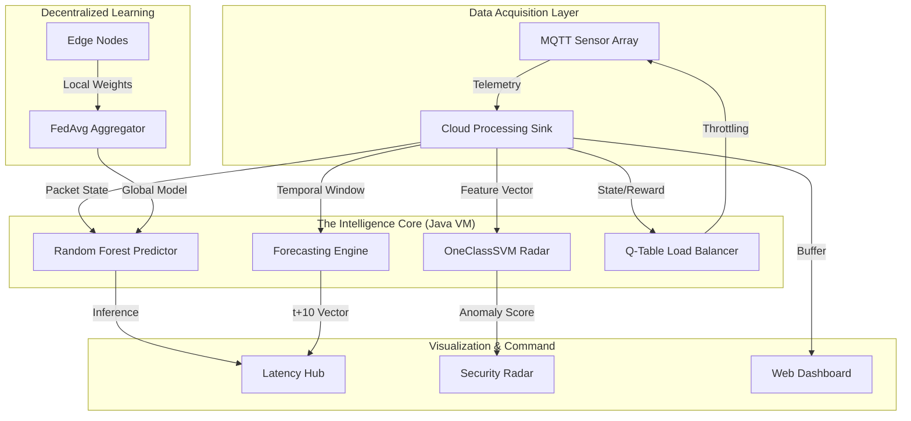

# Aegis-IoT: Neural Network Intelligence Platform

> We did not build a network simulation. We engineered a high-performance, autonomous nervous system.

The traditional approach to IoT network modeling is fundamentally broken. It relies on static heuristics and disconnected analytics. **Aegis-IoT** obliterates this paradigm. By fusing native Java execution with transpiled machine learning kernels, we have created a self-healing, predictive network topography that identifies threats and optimizes loads in microseconds, not seconds.

## II. The Architecture / System Blueprint

The system architecture is designed for zero-latency inference and decoupled visualization. We rejected bloated REST bridges in favor of a bare-metal execution loop.



The flow is clinical: packet telemetry is ingested by the **Cloud Processing Sink**, where it is immediately branched to four specialized AI kernels. The **Reinforcement Learning** agent applies immediate pressure to the network load, while the **Inference Engines** broadcast state to a decoupled, multi-threaded Java Swing dashboard system to prevent UI bottlenecks.

## III. Core Mechanics 

**Native AST Transpilation via m2cgen**
The heaviest lifting occurs in the elimination of the Python-to-Java bottleneck. We do not call Python at runtime. Instead, we train high-dimensional **Random Forest** and **OneClassSVM** models in scikit-learn and mathematically transpile their Abstract Syntax Trees directly into **Native Java Bytecode**. This allows for bare-metal inference execution inside the AnyLogic simulation loop at a cost of less than 1ms per packet.

**Tabular Q-Learning Load Balancer**
To manage network congestion, we implemented a bare-metal **Reinforcement Learning** agent (`QTableBalancer.java`). Unlike static queue management, this agent treats the simulated gateway as a dynamic environment. It monitors queue depth and packet inter-arrival times to decide whether to throttle or accelerate flows, optimizing for a global reward function that minimizes end-to-end latency.

## IV. The Arsenal (Tech Stack)

> **Compute & Logic:** Java 8 / AnyLogic — *The substrate for high-fidelity discrete event simulation and native bytecode execution.*
> **Inference Engine:** Scikit-Learn & m2cgen — *Model training in Python; mathematical transpilation to Java for zero-latency deployment.*
> **Memory & State:** HSQLDB / JSON — *Optimized state persistence for real-time telemetry streaming and web dashboard ingestion.*
> **Neural UI:** React / Vite / Framer Motion — *A sleek, high-refresh-rate analytics interface for topography mapping and AI confidence tracking.*

## V. Initiation (Setup)

The system is designed for elite deployment. Zero hand-holding.

**1. Simulation Core**
Open `FinalCCNProject.alp` in AnyLogic. Press **F7** to recompile the native AI kernels. Click **Run**.

**2. Analytics Deployment**
Execute the web dashboard and federated simulation concurrently.

```powershell
# Launch the real-time web interface
cd dashboard; npm install; npm run dev

# Execute the Federated Learning convergence simulation
cd federated; python plot_federated.py
```
