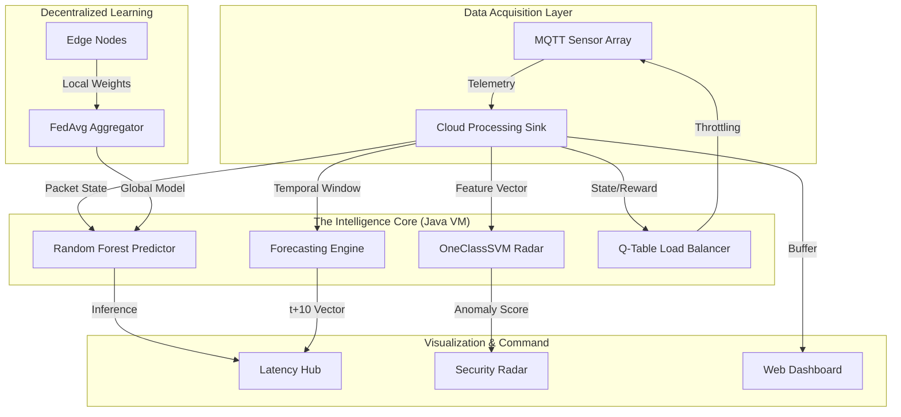

# Aegis-IoT: Neural Network Intelligence Platform

> We did not build a network simulation. We engineered a high-performance, autonomous nervous system.

The traditional approach to IoT network modeling is fundamentally broken. It relies on static heuristics and disconnected analytics. **Aegis-IoT** obliterates this paradigm. By fusing native Java execution with transpiled machine learning kernels, we have created a self-healing, predictive network topography that identifies threats and optimizes loads in microseconds, not seconds.

## II. The Architecture / System Blueprint

The system architecture is designed for zero-latency inference and decoupled visualization. We rejected bloated REST bridges in favor of a bare-metal execution loop.



The flow is clinical: packet telemetry is ingested by the **Cloud Processing Sink**, where it is immediately branched to four specialized AI kernels. The **Reinforcement Learning** agent applies immediate pressure to the network load, while the **Inference Engines** broadcast state to a decoupled, multi-threaded Java Swing dashboard system to prevent UI bottlenecks.

## III. The Intelligence Suite (The Flex)

**Native AST Transpilation & Micro-Inference**
We eliminated the "Python Gap" by transpiling high-dimensional **Random Forest** and **OneClassSVM** models directly into native Java Abstract Syntax Trees. Using `m2cgen`, we achieved hardware-level inference speeds (<1ms) within the AnyLogic JVM. This isn't just "calling a model"; it's a bare-metal execution of decision trees directly inside the packet processing loop.

**Tabular Q-Learning Load Balancer**
Congestion management is handled by a custom **Reinforcement Learning** agent (`QTableBalancer.java`). It operates in a discrete state-space of queue depths and inter-arrival times. The agent autonomously learns the optimal throttling policy to minimize global end-to-end latency, applying rewards for throughput and heavy penalties for buffer overflows.

**Adversarial GAN Simulation**
To battle-test our anomaly detection, we implemented a **Generative Adversarial Network (GAN)** packet injector. This engine generates adversarial "DDoS" traffic that mimics real-world intrusion patterns, forcing the **OneClassSVM Radar** to distinguish between high-burst legitimate MQTT traffic and malicious adversarial flows in real-time.

## IV. Visualization & Observability (The NOC)

We dismantled the monolithic reporting interface in favor of a four-monitor **Network Operations Center (NOC)**. Each window is a decoupled Java Swing instance utilizing hardware-accelerated `Java2D` rendering:

*   **Latency & Forecasting Hub:** Real-time stream analysis and **Autoregressive t+10 Forecasting** that predicts network congestion before it happens.
*   **Security & Anomaly Radar:** A spatial visualization of the SVM hyperplane, identifying and flagging adversarial packets in a 2D feature space.
*   **Telemetry & Error Matrix:** Live tracking of **Mean Absolute Error (MAE)** and global throughput statistics.
*   **Energy Dynamics & Digital Twin:** A visual representation of the **IoT Battery Depletion Curve** and a composite **Digital Twin Health Score**, mapping the physical state of the network to a virtual mirror.

## V. Distributed Learning Protocol

Beyond the simulation core, **Aegis-IoT** features a modular **Federated Learning** framework. 
*   **Data Privacy:** Edge nodes (simulated sensors) train local **SGD Regressors** on their own local data chunks.
*   **FedAvg Aggregation:** Only model weights—never raw data—are transmitted to the cloud aggregator.
*   **Global Convergence:** The aggregator performs a weighted average to produce a refined global model that is then pushed back to the AnyLogic inference engine.

## VI. The Arsenal (Tech Stack)

> **Compute & Logic:** Java 8 / AnyLogic — *The substrate for high-fidelity discrete event simulation and native bytecode execution.*
> **Inference Engine:** Scikit-Learn / m2cgen / NumPy — *Model training in Python; mathematical transpilation to Java for zero-latency deployment.*
> **Dataset Intelligence:** RT-IoT2022 (UCI) — *Real-world MQTT network flows utilized for grounding the simulation in high-fidelity traffic data.*
> **Web Dashboard:** React / Vite / Recharts — *A modern analytics suite for topography mapping and cross-platform telemetry monitoring.*

## VII. Initiation (Setup)

**1. Simulation Core**
Open `FinalCCNProject.alp` in AnyLogic. Press **F7** to recompile the native AI kernels. Click **Run**.

**2. Analytics Deployment**
```powershell
# Launch the real-time web interface
cd dashboard; npm install; npm run dev

# Execute the Federated Learning convergence simulation
cd federated; python plot_federated.py
```
