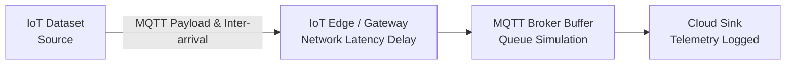

# 🌐 FinalCCNProject: IoT Network Simulation & AI-Assisted Dashboard

> **Semester Project — Computer Communications and Networks**  
> **Author:** Zain ul Abdeen (BS Artificial Intelligence, GIKI)

## 📌 Project Overview
The **FinalCCNProject** is an advanced, hybrid simulation of an **IoT (Internet of Things)** MQTT traffic pipeline. By combining **Agent-Based Modeling (ABM)** with **Discrete Event Simulation (DES)** via **AnyLogic**, this project moves beyond standard theoretical network topologies. It grounds the simulation in **real-world traffic data** and enhances it with an embedded **AI-assisted latency prediction model**.

A beautiful companion **Animated Dashboard** visualizes the packet-level flows and KPIs natively in the browser, providing a compelling, interactive presentation of real-time network throughput and packet latency.

## ✨ Key Features
- **Real-World Data Injection:** Integrates the open-source **UCI RT-IoT2022** dataset for scientifically grounded traffic inter-arrival times and packet payloads.
- **Embedded AI Predictor:** Uses a lightweight `scikit-learn` Linear Regression model, integrated via Jython, acting as a surrogate oracle within the simulation for real-time latency estimation.
- **Hybrid AnyLogic Architecture:** Uses the Process Modeling Library (queuing, delays, service blocks) combined with intelligent network agents.
- **Animated Browser Dashboard:** A 60-FPS HTML5 Canvas and Chart.js dashboard visually replays the sensor-to-cloud journey, providing real-time insights (Histograms, Time-series, KPI aggregations).

## 🗂️ Workspace Architecture

```text
FinalCCNProject/
├── 📊 FinalCCNProject.alp       # Core AnyLogic Simulation Model
├── 🌐 dashboard/                 # Animated UI & Presentation Dashboard
│   ├── index.html               # Presentation View (Live Animations & KPIs)
│   ├── app.js / styles.css      # Vanilla JS + CSS (Chart.js embedded)
│   └── data/                    # Extracted outputs bridging Model with Web UI
├── 💾 database/                  # HSQLDB database (contains MQTT_READY logs)
└── 🛠️ tools/                     # Automation & Data parsing
    ├── extract_mqtt_ready.py    # Extracts AnyLogic DB records to JSON/JS
    ├── extract_mqtt_ready.ps1   # PowerShell equivalent 
    └── proposal_extracted.txt   # Core academic research and justification 
```

## 🚀 Quick Start Guide

### 1. Run the AnyLogic Model
1. Install **AnyLogic 8.9+**.
2. Open the project file: `FinalCCNProject.alp`.
3. Launch the **Simulation** experiment to flow virtual packets and log telemetry to the internal `MQTT_READY` HSQLDB table.

### 2. Extract Data for the Dashboard
Extract the simulation data payload from the embedded AnyLogic database to feed the animated UI:
```bash
# Using Python
python tools/extract_mqtt_ready.py

# OR Using PowerShell (Windows native, no Python needed)
powershell -ExecutionPolicy Bypass -File tools/extract_mqtt_ready.ps1
```
*(This extracts raw rows from `database/db.script` and writes `mqtt_ready.js`, `.json`, and `.csv` cleanly into `dashboard/data/`.)*

### 3. Launch the Interactive Dashboard
The dashboard operates purely on the client side with a standalone runtime:
- Opening `dashboard/index.html` directly in any modern browser works seamlessly (`file://`).
- *Optional:* Serve it locally (`python -m http.server 8000` then visit `http://localhost:8000/dashboard/`).

## ⚙️ Technical Blueprint

### Network Simulation Lifecycle


### Technology Stack
- **Simulation Modeling:** AnyLogic 8.9.x (DES + ABM)
- **Data Backend:** HSQLDB (AnyLogic internal)
- **Machine Learning Component:** Python, Scikit-Learn (Linear Regression), joblib
- **Data Dashboard Tooling:** HTML5 Canvas, Vanilla Javascript, Chart.js
- **Pipelines:** Python / PowerShell

## 🔬 Academic Justification & Research Focus
As detailed in the fundamental project proposal, IoT environments suffer from resource restraints (energy, bandwidth, processing). 
- **The Dataset**: The UCI dataset ensures the packets traveling through the queues reflect realistic MQTT/CoAP characteristics.
- **The AI Predictor**: A Linear Regression model is deliberately chosen for its sub-millisecond inference speeds and analytical transparency. It doesn't require a GPU, guaranteeing the AnyLogic simulation stays fluid without external bottlenecks.

---
*Created for the GIKI Computer Communications & Networks course.*