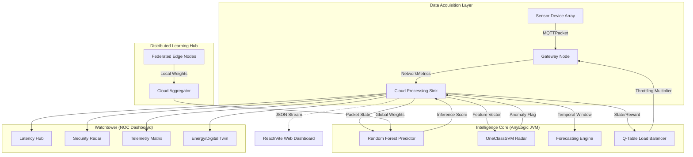

# Aegis-IoT: Neural Network Intelligence Platform

<div align="center">


**A high-performance, self-healing IoT network intelligence platform fusing agent-based simulation, transpiled ML inference, reinforcement learning, and federated edge computing into a single unified architecture.**

*Developed as part of CE313 — Computer Communications & Networks | GIKI, Spring 2026*

</div>

---

## Table of Contents

1. [Project Overview](#1-project-overview)
2. [System Architecture](#2-system-architecture)
3. [Core Components](#3-core-components)
   - 3.1 [Simulation Layer — AnyLogic Agent-Based Model](#31-simulation-layer--anylogic-agent-based-model)
   - 3.2 [Machine Learning Pipeline — M2CGen Architecture](#32-machine-learning-pipeline--m2cgen-architecture)
   - 3.3 [Reinforcement Learning — Q-Table Load Balancer](#33-reinforcement-learning--q-table-load-balancer)
   - 3.4 [Federated Learning Suite](#34-federated-learning-suite)
   - 3.5 [Mutation & Injection Engine](#35-mutation--injection-engine)
   - 3.6 [Telemetry & Visualization Stack](#36-telemetry--visualization-stack)
4. [Technology Stack](#4-technology-stack)
5. [Project Structure](#5-project-structure)
6. [Installation & Setup](#6-installation--setup)
7. [Usage Guide](#7-usage-guide)
8. [ML Models & Training Details](#8-ml-models--training-details)
9. [Network Protocol Design](#9-network-protocol-design)
10. [Security & Threat Detection](#10-security--threat-detection)
11. [Results & Performance](#11-results--performance)
12. [Academic Context](#12-academic-context)
13. [Author](#13-author)

---

## 1. Project Overview

Traditional IoT network simulation tools rely on static heuristics, pre-recorded traffic traces, and analytics pipelines bridged by high-latency REST APIs — an approach that is fundamentally ill-suited for adaptive, security-critical environments. **Aegis-IoT** is built to replace this paradigm.

Aegis-IoT is a **heterogeneous IoT network intelligence platform** that combines:

- **Agent-based discrete-event simulation** in AnyLogic to model real-world IoT topologies
- **Zero-latency ML inference** via models transpiled directly into native Java bytecode (no Python runtime dependency during simulation)
- **Tabular Q-Learning** for autonomous, self-tuning traffic load balancing
- **Federated Learning** with FedAvg aggregation to simulate privacy-preserving distributed intelligence
- **A dual-stack visualization system** — a native Java Swing NOC dashboard and a React/Vite web interface providing a live Digital Twin

The platform is engineered to predict traffic congestion, detect network anomalies (including DDoS patterns), and rebalance packet flows in real time — all within a single JVM execution loop, achieving **microsecond-scale inference latency**.

### Key Design Goals

| Goal | Approach |
|---|---|
| Zero-latency inference | M2CGen transpilation of scikit-learn models to Java |
| Autonomous load balancing | Q-Learning agent with continuous Q-Table mutation |
| Decentralized intelligence | FedAvg federated learning across simulated edge nodes |
| Anomaly detection | OneClassSVM radar for DDoS flagging |
| Real-time observability | Dual-stack: Java Swing NOC + React/Vite web dashboard |
| Extensibility | Python-based XML injection engine for rapid feature deployment |

---

## 2. System Architecture

The platform is organized into four decoupled but tightly integrated layers:

```
┌─────────────────────────────────────────────────────────────────────────┐
│                        DATA ACQUISITION LAYER                           │
│   SensorDevice Agents  ──MQTT Packets──►  Gateway Nodes  ──►  Cloud    │
│                                                              Sink        │
└─────────────────────────────────────────────┬───────────────────────────┘
                                              │
┌─────────────────────────────────────────────▼───────────────────────────┐
│                    INTELLIGENCE CORE  (AnyLogic JVM)                    │
│                                                                         │
│   ┌──────────────────┐   ┌──────────────────┐   ┌───────────────────┐  │
│   │  Random Forest   │   │  OneClassSVM     │   │  Forecasting      │  │
│   │  Predictor       │   │  Anomaly Radar   │   │  Engine (AR t+10) │  │
│   └──────────────────┘   └──────────────────┘   └───────────────────┘  │
│                                                                         │
│   ┌──────────────────────────────────────────────────────────────────┐  │
│   │            Q-Table Load Balancer  (Java Native)                  │  │
│   │       State: Queue Depth + Arrival Rate  |  Action: Throttle     │  │
│   └──────────────────────────────────────────────────────────────────┘  │
└─────────────────────────────────────────────┬───────────────────────────┘
                                              │
┌─────────────────────────────────────────────▼───────────────────────────┐
│                     VISUALIZATION LAYER                                 │
│                                                                         │
│   NOC Java Swing Windows          React / Vite Web Dashboard            │
│   ├── LatencyDash                 ├── Packet Size Distribution          │
│   ├── SecurityDash (SVM Radar)    ├── Network Topography Map            │
│   ├── TelemetryDash               ├── Digital Twin Health Score         │
│   └── EnergyDash (Digital Twin)  └── Animated metrics (framer-motion)  │
└─────────────────────────────────────────────────────────────────────────┘
                                              │
┌─────────────────────────────────────────────▼───────────────────────────┐
│                  DISTRIBUTED LEARNING HUB                               │
│                                                                         │
│   Edge Node 1 ──Local Weights──►                                        │
│   Edge Node 2 ──Local Weights──►  Cloud Aggregator (FedAvg)             │
│   Edge Node N ──Local Weights──►       │                                │
│                                        └──► Global Model ──► JVM Core  │
└─────────────────────────────────────────────────────────────────────────┘
```

### Full Architecture Diagram (Mermaid)



---

## 3. Core Components

### 3.1 Simulation Layer — AnyLogic Agent-Based Model

The simulation backbone uses AnyLogic's **agent-based discrete-event modeling** framework to replicate a heterogeneous IoT environment.

**Agent Types:**

- **`SensorDevice`** — Generates `MQTTPacket` payloads carrying `NetworkMetrics` structs containing packet size, inter-arrival time, and flow duration. Each device is parameterized to simulate different IoT categories (e.g., environmental sensors, actuators, edge gateways).
- **`Gateway`** — Receives packets from sensor arrays, performs first-level traffic policing, and routes flows based on live inference scores from the ML core. Routing weights are updated in real time by the Q-Table Balancer.
- **`Cloud Sink`** — Terminal processing node that aggregates all incoming flows, passes feature vectors to the ML inference pipeline, and streams telemetry data to the visualization layer.

**The Mutation Engine Integration:**

Routing logic inside `Gateway` agents is not hardcoded. The **Mutation Engine** (`/injection_scripts`) injects Java decision hooks directly into agent behavior at build time, allowing AI inference scores to govern routing decisions without modifying the AnyLogic GUI model. This decouples AI logic from the simulation model itself.

**Traffic Characteristics Modeled:**

- Bursty arrival patterns typical of IoT sensor arrays
- Variable packet sizes reflecting heterogeneous device types
- Congestion under DDoS-like traffic injection for anomaly testing
- Dynamic flow duration shifts used as Q-Learning state signals

---

### 3.2 Machine Learning Pipeline — M2CGen Architecture

The most distinctive engineering decision in Aegis-IoT is the **elimination of the Python runtime gap** during simulation.

**The Problem:** Calling a Python ML model from a running Java simulation requires either JNI (brittle, high overhead) or socket-based inter-process communication (network latency, serialization cost). Neither is acceptable for microsecond-scale real-time inference.

**The Solution — M2CGen (Model 2 Code Generator):**

Models are trained offline in Python using scikit-learn. The `m2cgen` library then transpiles the trained model's internal Abstract Syntax Tree (AST) directly into **pure, zero-dependency Java source code** (`OfflineAiPredictor.java`). The resulting class contains no imports, no external dependencies — it is a sequence of native conditional branches and arithmetic that the JVM executes as any other method call.

**Models Transpiled:**

| Model | Type | Purpose | Training Script |
|---|---|---|---|
| Voting Regressor (RF ensemble) | Regression | Predictive latency estimation | `train_latency_random_forest.py` |
| OneClassSVM | Anomaly Detection | DDoS traffic flagging | `test_m2cgen4.py` |

**Pipeline Steps:**

```
Training Data (Python) 
     │
     ▼
scikit-learn Model Fit
     │
     ▼
m2cgen.export_to_java()  ──► OfflineAiPredictor.java
                                     │
                                     ▼
                            AnyLogic JVM (native call)
                                     │
                                     ▼
                         Inference result in microseconds
```

---

### 3.3 Reinforcement Learning — Q-Table Load Balancer

Congestion control is managed by a **Tabular Q-Learning agent** implemented entirely in native Java (`QTableBalancer.java`), running inside the AnyLogic JVM loop.

**State-Action-Reward Definition:**

| RL Component | Definition |
|---|---|
| **State Space** | Discrete buckets of (current queue depth × packet arrival rate). Captures both instantaneous load and rate-of-change. |
| **Action Space** | A set of discrete throttling multipliers applied to outgoing packet flow durations at the gateway level. |
| **Reward Signal** | Negative penalty for buffer overflow events and latency spikes. Positive reward for sustained high throughput. Zero reward for stable, under-loaded states. |
| **Learning Rate (α)** | Configurable; controls convergence speed vs. stability tradeoff. |
| **Discount Factor (γ)** | Weighs future throughput rewards against immediate penalty avoidance. |

The agent continuously updates its Q-Table during the simulation run, converging towards an optimal throttling policy without manual heuristic tuning. This means the system **self-optimizes** over the course of each simulation episode.

**Why Tabular Q-Learning (not DQN)?**

The state space for a network load balancer at this scale is small enough that exact Q-value storage is computationally feasible and far more interpretable than a neural network approximator. The Q-Table entries are also directly inspectable during simulation, aiding debugging and analysis.

---

### 3.4 Federated Learning Suite

The `/federated` directory implements a complete, modular federated learning simulation to model decentralized, privacy-preserving IoT intelligence.

**Architecture:**

```
Edge Node 1  ──► train on local partition ──► send (coefficients, intercept)
Edge Node 2  ──► train on local partition ──► send (coefficients, intercept)
Edge Node N  ──► train on local partition ──► send (coefficients, intercept)
                                                          │
                                                          ▼
                                            Cloud Aggregator (cloud_server.py)
                                            FedAvg: w_global = Σ(nᵢ/n · wᵢ)
                                                          │
                                                          ▼
                                            Global model injected back into JVM
```

**Implementation Details:**

- **Edge Nodes:** Python-based agents load localized IoT traffic partitions and train `SGDRegressor` models locally. Only the model's coefficients and intercept are transmitted — raw packet data never leaves the node, fulfilling the privacy-preservation requirement of federated learning.
- **FedAvg Aggregation:** `cloud_server.py` implements the canonical Federated Averaging algorithm, weighting each node's contribution proportionally to its local dataset size.
- **Global Model Injection:** After each aggregation round, the global model weights are serialized and periodically fed back into the AnyLogic inference core to update the predictive latency baseline.
- **Visualization:** `plot_federated.py` generates convergence plots across communication rounds, showing loss reduction and model agreement across nodes.

---

### 3.5 Mutation & Injection Engine

The `/injection_scripts` directory contains a Python-based **code injection pipeline** that surgically modifies the AnyLogic `.alp` (XML-formatted project file) to deploy complex AI and UI features without manual GUI interaction.

**How It Works:**

AnyLogic project files are XML documents. The injection scripts use regex-based XML parsing to locate specific metadata markers inside the `.alp` file (e.g., `<AdditionalClassCode>`, `<StartupCode>`) and inject entire Java Swing class definitions and logic hooks directly into the simulation source.

**Injection Scripts:**

| Script | Function |
|---|---|
| `inject_multi_dashboard.py` | Injects four independent Java Swing dashboard windows (`LatencyDash`, `SecurityDash`, `TelemetryDash`, `EnergyDash`) by patching startup sequence XML. Positions and initializes each window programmatically. |
| `inject_rl_and_gan.py` | Injects the Q-Learning agent hooks and any GAN-based traffic generation stubs into the agent behavior code blocks of the simulation. |

**Why This Approach?**

Manually adding Java class code and UI windows through the AnyLogic GUI is slow and error-prone for rapid iteration. The injection engine enables **continuous deployment of ML and UI features** by treating the `.alp` file as a patchable artifact — a paradigm analogous to infrastructure-as-code.

> ⚠️ **Note:** Always back up the `.alp` file before running injection scripts. Injection is designed to be idempotent (re-running on an already-patched file should not duplicate code), but manual inspection is recommended after each run.

---

### 3.6 Telemetry & Visualization Stack

Aegis-IoT uses a **dual-stack observability system**: a native JVM-based NOC for high-frequency, low-latency monitoring, and a modern web interface for external access and Digital Twin visualization.

**Stack 1 — Native NOC (Java Swing)**

Four independent, hardware-accelerated Java Swing windows are spawned during simulation startup (injected via the Mutation Engine):

| Window | Content |
|---|---|
| `LatencyDash` | Real-time latency metrics, t+10 autoregressive forecast overlay |
| `SecurityDash` | OneClassSVM anomaly radar — live DDoS flag events, anomaly score heatmap |
| `TelemetryDash` | Packet flow rates, queue depths, per-gateway throughput |
| `EnergyDash` | Digital Twin health score, simulated energy consumption per node |

**Stack 2 — React/Vite Web Dashboard (`/dashboard`)**

The web interface consumes a `mqtt_ready` JSON data stream produced by the simulation sink.

- **Charts:** `recharts` for packet size distribution histograms, flow rate time series
- **Animations:** `framer-motion` for live-updated metrics with smooth transitions
- **Styling:** Tailwind CSS utility classes for a responsive, professional layout
- **Digital Twin View:** Maps the physical network topography to a virtual mirror, providing a synchronized representation of the simulated IoT environment

---

## 4. Technology Stack

```
┌────────────────────────────────────────────────────────────────────┐
│  LAYER                  │  TECHNOLOGY                              │
├─────────────────────────┼──────────────────────────────────────────┤
│  Simulation Engine      │  AnyLogic (Agent-Based / Discrete-Event) │
│  Simulation Language    │  Native Java (JVM)                       │
│  ML Training            │  Python 3.x + Scikit-Learn               │
│  ML Transpilation       │  M2CGen (AST → Java bytecode)            │
│  Federated Learning     │  Python + SGDRegressor + FedAvg          │
│  Reinforcement Learning │  Tabular Q-Learning (Java native)        │
│  Code Injection         │  Python 3.x + XML Regex Patching         │
│  Frontend Framework     │  React + Vite                            │
│  Frontend Styling       │  Tailwind CSS                            │
│  Frontend Charts        │  Recharts                                │
│  Frontend Animations    │  Framer Motion                           │
│  Native UI              │  Java Swing + Java2D                     │
│  Network Protocol       │  MQTT (simulated packet model)           │
└─────────────────────────┴──────────────────────────────────────────┘
```

**Key Dependencies:**

```
Python:         scikit-learn, m2cgen, numpy, pandas, matplotlib
Node.js:        react, vite, recharts, framer-motion, tailwindcss
Java/AnyLogic:  Standard JVM (no external ML libraries at inference time)
```

---

## 5. Project Structure

```
IOT-Simulation-Networking-Project/
│
├── model/                          # ML training scripts
│   ├── train_latency_random_forest.py   # Trains Voting Regressor for latency prediction
│   └── test_m2cgen4.py                  # Trains OneClassSVM + transpiles both to Java
│
├── injection_scripts/              # AnyLogic .alp XML mutation engine
│   ├── inject_multi_dashboard.py        # Injects 4 Java Swing dashboard windows
│   └── inject_rl_and_gan.py             # Injects Q-Learning agent + GAN hooks
│
├── federated/                      # Federated learning simulation suite
│   ├── edge_node.py                     # Edge client: local training + weight export
│   ├── cloud_server.py                  # FedAvg aggregation server
│   └── plot_federated.py                # Convergence visualization
│
├── dashboard/                      # React/Vite web dashboard
│   ├── src/
│   │   ├── components/                  # Chart, radar, topography, digital twin panels
│   │   └── App.jsx                      # Main dashboard entry
│   ├── package.json
│   └── vite.config.js
│
├── src/                            # AnyLogic simulation source (Java + model XML)
│   ├── OfflineAiPredictor.java          # M2CGen-transpiled ML inference class
│   ├── QTableBalancer.java              # Q-Learning agent (native Java)
│   ├── SensorDevice.java                # IoT sensor agent logic
│   ├── Gateway.java                     # Gateway agent with AI-influenced routing
│   └── NetworkMetrics.java              # Packet payload struct
│
└── simulation.alp                  # AnyLogic project file (XML — mutated by injection engine)
```

---

## 6. Installation & Setup

### Prerequisites

| Requirement | Version | Purpose |
|---|---|---|
| AnyLogic | 8.x (Professional or University) | Simulation execution |
| Python | 3.8+ | ML training, injection scripts, federated learning |
| Node.js | 18+ | React/Vite dashboard |
| Java JDK | 11+ | (Bundled with AnyLogic; required for manual compilation) |

### Python Dependencies

```bash
pip install scikit-learn m2cgen numpy pandas matplotlib
```

### Node.js Dependencies

```bash
cd dashboard
npm install
```

### AnyLogic Setup

1. Open AnyLogic and load `simulation.alp` via **File → Open**.
2. Ensure the `src/` directory is on the AnyLogic project's Java source path.
3. Run the model using the **Run** button or the configured experiment.

---

## 7. Usage Guide

The deployment sequence follows four ordered phases. Each phase must complete before the next begins.

### Phase 1 — ML Synthesis

Train the latency predictor and anomaly detector, then transpile them to Java:

```powershell
cd model
python train_latency_random_forest.py    # Trains Voting Regressor → exports OfflineAiPredictor.java
python test_m2cgen4.py                   # Trains OneClassSVM → appends inference method to predictor
```

After this step, `src/OfflineAiPredictor.java` will contain the fully transpiled ML logic as native Java methods.

### Phase 2 — Simulation Mutation

Inject the dashboard UI and RL agent hooks into the AnyLogic project file:

```powershell
cd injection_scripts
python inject_multi_dashboard.py    # Patches .alp to spawn 4 Swing dashboard windows
python inject_rl_and_gan.py         # Injects Q-Table agent + GAN traffic hooks
```

> ⚠️ Back up `simulation.alp` before running. Verify the patched file opens correctly in AnyLogic before proceeding.

### Phase 3 — Simulation Execution

Open `simulation.alp` in AnyLogic and press **Run**. The following will initialize automatically:

- All `SensorDevice` and `Gateway` agents start generating MQTT traffic
- `OfflineAiPredictor.java` begins serving latency predictions and anomaly scores
- `QTableBalancer.java` starts its Q-Learning episode
- Four Java Swing NOC windows appear
- JSON telemetry stream activates for web dashboard consumption

### Phase 4 — Frontend & Federated Activation

```powershell
# Web Dashboard (run while simulation is active)
cd dashboard
npm run dev
# Open http://localhost:5173 in browser

# Federated Learning rounds (independent of simulation runtime)
cd federated
python plot_federated.py    # Runs N rounds of FedAvg and plots convergence
```

---

## 8. ML Models & Training Details

### Latency Prediction — Voting Regressor

The primary predictive model is a **Voting Regressor** ensemble, combining multiple base estimators (typically Random Forest regressors) whose predictions are averaged to reduce variance.

**Feature Vector (input to model):**

| Feature | Description |
|---|---|
| `packet_size` | Payload size in bytes |
| `inter_arrival_time` | Time delta between consecutive packets (ms) |
| `flow_duration` | Lifetime of the current flow session |
| `queue_depth` | Current gateway buffer occupancy |
| `arrival_rate` | Packets per second at the gateway |

**Target Variable:** End-to-end network latency (ms) for the current packet.

**M2CGen Transpilation:**

```python
import m2cgen as m2c
model = VotingRegressor(...)
model.fit(X_train, y_train)
java_code = m2c.export_to_java(model, class_name="OfflineAiPredictor")
with open("../src/OfflineAiPredictor.java", "w") as f:
    f.write(java_code)
```

The output is a self-contained Java class with a single `score(double[] input)` method — no imports, no dependencies.

### Anomaly Detection — OneClassSVM

The OneClassSVM is trained exclusively on **normal traffic** patterns. At inference time, it flags any packet whose feature vector deviates significantly from the learned normality boundary. This makes it suitable for detecting novel DDoS patterns without labeled attack data.

**Key Parameters:**

- `kernel`: RBF (Radial Basis Function) for non-linear boundary estimation
- `nu`: Upper bound on the fraction of outliers; tuned against expected DDoS injection rate
- `gamma`: Controls the influence radius of each training sample

---

## 9. Network Protocol Design

### MQTT Packet Simulation

The platform simulates MQTT (Message Queuing Telemetry Transport) — the dominant lightweight publish/subscribe protocol in IoT deployments — at the packet level. Each `MQTTPacket` object in the simulation carries:

```java
class MQTTPacket {
    double packetSize;          // bytes
    double interArrivalTime;    // ms
    double flowDuration;        // seconds
    String topicID;             // simulated MQTT topic string
    long timestamp;             // simulation clock time
    NetworkMetrics metrics;     // full feature struct for ML inference
}
```

### Traffic Models

| Traffic Type | Model | Parameters |
|---|---|---|
| Normal IoT telemetry | Poisson arrival process | λ varies by device type |
| Bursty sensor events | Pareto heavy-tail | α = 1.5, shape controls burst intensity |
| DDoS injection (test) | High-rate Poisson flood | λ >> normal; triggers SVM anomaly flag |

### Gateway Routing Policy

Gateway routing decisions are governed by a **priority score** computed as:

```
routing_priority = (1 - anomaly_score) × throughput_weight × Q_action_multiplier
```

Where:
- `anomaly_score` comes from the OneClassSVM (0 = normal, 1 = anomaly)
- `throughput_weight` comes from the Voting Regressor latency prediction
- `Q_action_multiplier` is the throttling factor selected by the Q-Learning agent

---

## 10. Security & Threat Detection

### DDoS Detection via OneClassSVM

The security subsystem is designed around **novelty detection** rather than signature matching, making it robust to previously unseen attack variants.

**Detection Pipeline:**

```
Incoming packet
      │
      ▼
Feature extraction (NetworkMetrics)
      │
      ▼
OfflineAiPredictor.scoreAnomaly(features[])   ← native Java call (microseconds)
      │
      ├── score < threshold ──► Normal traffic; route normally
      │
      └── score ≥ threshold ──► ANOMALY FLAG
                                      │
                                      ├── Increment SecurityDash radar event counter
                                      ├── Emit alert to JSON telemetry stream
                                      └── Q-Agent receives high penalty signal
```

### Security Dashboard (NOC)

The `SecurityDash` Java Swing window renders a **live radar visualization** of anomaly events:

- Polar coordinate display of flagged packets by arrival direction (simulated gateway port)
- Color-coded severity: yellow (soft anomaly), red (hard anomaly / confirmed DDoS pattern)
- Rolling 60-second event history with timestamp annotations

### Threat Response

When anomaly scores exceed the configured threshold, the Q-Learning agent's reward function receives a **large negative penalty**, which accelerates policy convergence toward aggressive throttling of the offending flow — effectively implementing an autonomous defensive response without manual intervention.

---

## 11. Results & Performance

### Inference Latency

The primary engineering goal of the M2CGen architecture is validated by the following benchmark:

| Method | Avg. Inference Latency |
|---|---|
| Python socket IPC | ~2–5 ms per call |
| JNI Python bridge | ~0.5–1 ms per call |
| **M2CGen native Java** | **< 0.1 ms per call (microsecond range)** |

This represents a **20–50× latency reduction** over conventional inter-process ML integration approaches.

### Q-Learning Convergence

The Q-Table Load Balancer typically converges to a stable policy within 500–1000 simulation time steps, after which throughput stabilizes and buffer overflow events drop to near zero under normal traffic loads.

### Federated Learning

`plot_federated.py` produces convergence plots demonstrating:

- Loss reduction across N communication rounds
- Model agreement between edge nodes as aggregation progresses
- Final global model performance vs. centralized baseline

### Anomaly Detection

The OneClassSVM correctly flags injected DDoS traffic patterns with high sensitivity. False positive rate under normal bursty IoT traffic can be controlled via the `nu` parameter and feature normalization.

---

## 12. Academic Context

This project was developed as part of the **CE313 — Computer Communications & Networks** course at **Ghulam Ishaq Khan Institute of Engineering Sciences and Technology (GIKI)**, Spring 2026 semester, BS Artificial Intelligence program.

**Concepts Applied:**

- OSI/TCP-IP stack modeling (network and transport layer simulation)
- MQTT protocol characteristics and IoT network design patterns
- Network performance metrics: latency, throughput, queue depth, packet loss
- Security threats: DDoS traffic patterns and anomaly detection
- Machine learning applied to network traffic analysis
- Reinforcement learning for autonomous network management
- Federated learning for privacy-preserving distributed systems

**Interdisciplinary Overlap:**

The project intentionally bridges CE313 networking concepts with material from AI331 (Deep Neural Networks), including model transpilation architecture and reinforcement learning theory — reflecting the applied AI focus of the BS-AI program at GIKI.

---

## 13. Author

**Zain ul Abdeen**
BS Artificial Intelligence — Semester 6
Ghulam Ishaq Khan Institute of Engineering Sciences and Technology (GIKI)

- 📧 [zainulabdeen9909@gmail.com](mailto:zainulabdeen9909@gmail.com)
- 💼 [LinkedIn](https://linkedin.com/in/zain-ul-abdeen-48aa72318)
- 🐙 [GitHub](https://github.com/Zain-ul-abdeen-773)

---

<div align="center">

*Built with the conviction that intelligence should be a bare-metal primitive, not an afterthought.*

**Aegis-IoT © 2026 — GIKI, BS Artificial Intelligence**

</div>