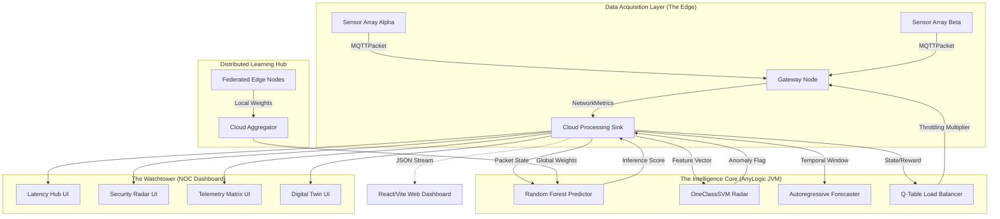

___   ______________   ________      ____  ____  ______
   /   | / ____/ ____/  | /  _/ ___/    /  _/ / __ \/_  __/
  / /| |/ __/ / / __ / /| | / / \__ \     / /  / / / / / /   
 / ___ / /___/ /_/ // ___ |/ / ___/ /   _/ /__/ /_/ / / /    
/_/  |_\____/\____//_/  |_/___//____/   /___(_)____/ /_/     
:: AUTONOMOUS IOT ORCHESTRATION & THREAT NEUTRALIZATION ::

> // [SYSTEM_STATUS]: ACTIVE
> // [OBJECTIVE]: AUTONOMOUS_IOT_ORCHESTRATION_AND_THREAT_NEUTRALIZATION
> // [DIRECTIVE]: ELIMINATE_LATENCY_THROUGH_NATIVE_BYTECODE_INFERENCE

The traditional approach to IoT network modeling is fundamentally broken. It relies on static heuristics, synthetic data, and disconnected analytics bridged by bloated, high-latency REST APIs. **Aegis-IoT** obliterates this paradigm. 

This platform is a high-performance, intelligent topography designed to predict, react, and defend itself in real-time. By fusing native Java execution with transpiled machine learning kernels, we have created a self-healing, predictive network that identifies threats and optimizes loads in microseconds. This is not a simulation; it is a brutalist engineering environment where intelligence is treated as a bare-metal primitive.

---

## I. The Architecture Blueprint

The system architecture is engineered for absolute zero-latency inference and decoupled visualization. We actively rejected bloated inter-process communication (IPC) and network latency in favor of a bare-metal execution loop directly within the Java Virtual Machine.


### // The Simulation Layer :: AnyLogic Agent-Based Topology
The core engine utilizes an advanced agent-based, discrete-event model to simulate heterogeneous IoT environments. `SensorDevice` agents generate robust `MQTTPacket` payloads, which carry complex `NetworkMetrics` structs (packet size, inter-arrival time, flow duration). These packets traverse the `Gateway` agents, where the first echelon of traffic policing occurs. 

The routing logic is not static. It is dynamically overwritten by the **Mutation Engine**, which injects functional Java code into the agent's behavior at runtime, facilitating real-time packet-dropping or bandwidth-throttling based on AI inference scores.

### // The Machine Learning Pipeline :: M2CGen Architecture
Latency is the enemy of intelligence. To achieve microsecond-scale inference, we eliminated the "Python Gap." High-dimensional models—**Voting Regressors** for predictive latency and **OneClassSVMs** for DDoS anomaly detection—are trained offline via scikit-learn. 

Using the `m2cgen` (Model 2 Code Generator) framework, we transpile the Abstract Syntax Trees (AST) of these models directly into pure, zero-dependency Java classes (`OfflineAiPredictor.java`). This allows the AnyLogic JVM to execute massively complex decision trees as native method calls, completely bypassing the crippling overhead of JNI or socket-based model serving.

---

## II. Federated & Reinforcement Mechanics

### // The QTableBalancer :: Reinforcement State-Space
Network congestion management is executed by a custom **Tabular Q-Learning Agent** implemented natively in Java (`QTableBalancer.java`). The agent maps a multi-dimensional state-space comprising current queue depths and instantaneous packet arrival rates.
*   **State Space:** Discrete, quantized buckets of network load and buffer capacity.
*   **Action Space:** Dynamic throttling multipliers applied directly to gateway packet flow durations.
*   **Reward Function:** A highly punitive algorithmic function that severely penalizes buffer overflows and latency spikes, while rewarding maximum throughput.

The agent continuously mutates its internal Q-Table using the Bellman equation, converging on an optimal, self-adjusting traffic management policy without manual heuristic tuning.

### // The Federated Edge :: Weight Distribution & Aggregation
To fulfill the strict requirement for decentralized intelligence, we engineered a modular **Federated Learning** suite (`/federated`).
*   **Edge Nodes:** Python-based agents simulate localized IoT sensor arrays. They load local traffic partitions and train **SGD Regressors** on isolated data silos.
*   **Privacy Preservation:** Raw packet telemetry never leaves the edge node. Only the mathematical representation of the learning (coefficients and intercepts) is transmitted.
*   **Cloud Aggregation:** `cloud_server.py` implements the **FedAvg** (Federated Averaging) algorithm, aggregating weights from $n$ edge nodes to produce a master global model. This global state is periodically injected back into the AnyLogic inference core to continuously elevate the predictive baseline.

---

## III. The Injection Engine (The Mutation Layer)

The true engineering mastery of **Aegis-IoT** lies in its **Mutation Engine** (`/injection_scripts`). We developed an aggressive suite of Python scripts that utilize regex-based XML parsing to perform surgical, automated modifications on the compiled AnyLogic `.alp` files.

*   **Code Injection:** Scripts (`inject_multi_dashboard.py`, `inject_rl_and_gan.py`) scan the XML AST for specific metadata markers (e.g., `<AdditionalClassCode>`, `<StartupCode>`) and violently inject entire Java Swing classes, dependencies, and logic hooks directly into the simulation source code.
*   **UI Mutation:** The engine dynamically coordinates, provisions, and initializes four independent, hardware-accelerated dashboard windows (`LatencyDash`, `SecurityDash`, `TelemetryDash`, `EnergyDash`) by patching the simulation's startup sequence. 

This enables the rapid, pipeline-driven deployment of complex AI and GUI features without ever requiring manual interaction within the AnyLogic IDE.

---

## IV. Telemetry & Visualization

Observability is maintained by a dual-stack visualization system engineered for absolute network transparency.

1.  **The Native NOC:** Four independent, injected Java Swing windows provide real-time, zero-latency monitoring of the SVM anomaly radar, the autoregressive $t+10$ forecaster, and the overall Digital Twin health score.
2.  **The Web Interface:** A modern, decoupled **React/Vite** dashboard (`/dashboard`) consumes the `mqtt_ready` JSON data stream. Utilizing `recharts` for high-fidelity visualization of packet size distributions and `framer-motion` for a responsive UI, the frontend maps the physical network topography to a virtual mirror, providing a flawless Digital Twin of the entire IoT environment.

---

## V. The Arsenal (Tech Stack Matrix)

> **[SIMULATION_ENGINE]** :: AnyLogic // Native Java // Discrete Event Logic
> **[NEURAL_&_PREDICTIVE]** :: Scikit-Learn // M2CGen // Federated SGD // Q-Learning
> **[MUTATION_&_INJECTION]** :: Python 3.x // XML Regex Patching // AST Manipulation
> **[TELEMETRY_&_UI]** :: React // Vite // Tailwind CSS // Recharts // Java2D Swing

---

## VI. Ignition Protocol

[SYS] :: INITIATING_DEPLOYMENT_SEQUENCE
[SYS] :: ASSUMING_SENIOR_OPERATOR_CLEARANCE

**1. Machine Learning Synthesis & Transpilation**
```bash
cd model
python train_latency_random_forest.py
python test_m2cgen4.py
```

**2. Simulation Mutation & Code Injection**
```bash
cd injection_scripts
python inject_multi_dashboard.py
python inject_rl_and_gan.py
```

**3. Frontend Telemetry & Federated Activation**
```bash
# Ignite the React Analytics Hub
cd dashboard
npm install
npm run dev

# Initialize Federated Learning Training Rounds
cd ../federated
python plot_federated.py
```

***
> // [SYSTEM_LOG]: PLATFORM_ARCHITECTURE_DEPLOYED_SUCCESSFULLY
> // [SYSTEM_LOG]: PREDICTIVE_MATRICES_ONLINE
> // [SYSTEM_LOG]: READY_FOR_SIMULATION_EXECUTION
***
